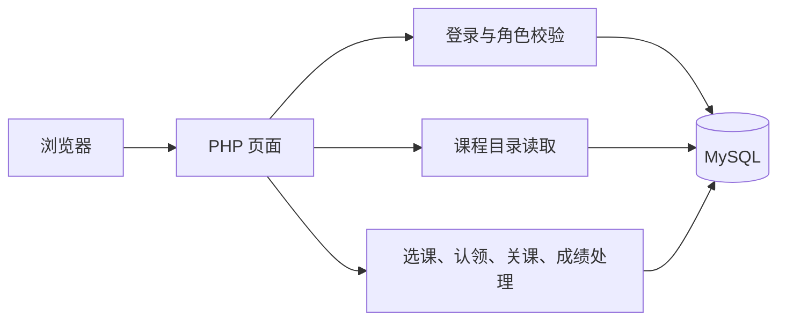

# 课程注册系统设计文档

版本：1.0　日期：2026-09-30

## 1. 设计范围

本文对应[需求分析文档](课程注册系统需求分析文档.md)中的登录、课程查询、教师认领、学生选课与退课、课表、关闭选课和成绩管理。系统采用 PHP 页面渲染、MySQL 持久化的浏览器访问方式。未配置数据库时保留 Session 演示模式；课程数据和业务记录只有在 MySQL 模式下才能跨账号、跨会话共享。

## 2. 系统结构

页面负责接收输入、显示结果和跳转；身份校验在 `Page/auth.php`，数据库连接在 `Page/db.php`。主要业务处理分别位于 `Page/student_registration_db.php`、`Page/teacher_claim_db.php`、`Page/admin_closure_db.php` 和 `Page/teacher_grades_db.php`。课程目录由 `Page/data/catalog_runtime.php` 读取数据库，再交给各页面展示；无数据库时使用 `Page/data/catalog.php` 的固定演示数据。

### 2.1 页面与权限

| 页面 | 角色 | 作用 |
| --- | --- | --- |
| `login.php`、`index.php`、`logout.php` | 全部 | 登录、进入首页和退出。未登录访问业务页转到登录页。 |
| `courses.php`、`course.php` | 已登录用户 | 查询、筛选教学班，查看教师、时间、地点、先修课和名额。 |
| `selection.php`、`schedule.php`、`grades.php` | 学生 | 提交或调整 4+2 方案、退课、查看课表和成绩。 |
| `teaching.php`、`grade_entry.php` | 教师 | 认领教学班；为本人已结课教学班录入成绩。 |
| `admin_closure.php` | 教务员 | 查看当前情况，截止后关闭选课并查看结果。 |

`requireLogin()` 和 `requireRole()` 在服务端检查访问权限。业务请求中的学生和教师身份来自登录 Session，不使用表单提供的用户 ID。

## 3. 数据设计

数据表由 `database/schema.sql` 创建。`database/import_demo.php --demo` 只向空的开发库导入样例账号、课程、教学班、占座和历史成绩，不用于正式数据录入。

| 数据表 | 主要关系与作用 |
| --- | --- |
| `users` | 统一保存学生、教师、教务员账号；`role` 区分权限，`is_active` 控制能否登录。 |
| `semesters` | 保存学期、选课起止时间、开放或关闭状态。 |
| `courses`、`course_prerequisites` | 保存课程名称、简介和先修课程关系。 |
| `offerings`、`offering_times` | 保存学期教学班、教师、地点、容量、状态及一段或多段每周上课时间。 |
| `teacher_claims` | 记录教师主动认领；预先安排的教师没有认领记录，不能通过认领页自行取消。 |
| `selection_choices` | 保存学生当前方案中的首选和有顺序的备选。备选记录本身不占名额。 |
| `enrollments` | 保存实际占座、退课和停开记录；只有 `active` 计入已选人数，`source` 区分首选与备选补入。 |
| `offering_closure_results`、`closure_backup_attempts` | 保存教学班关闭时的原人数、开设或停开原因，以及每个实际尝试过的备选结果。 |
| `grades` | 与一条占座记录一对一，未录入时 `grade_value` 可为空。 |

教学班容量不超过 10；数据库使用外键、唯一键与可用的 `CHECK` 约束保存单行规则。有效人数、先修课、时间冲突等跨表规则在业务事务内检查。完整字段和索引以[建表脚本](database/schema.sql)为准。

### 3.1 状态约定

| 对象 | 状态 | 含义 |
| --- | --- | --- |
| 学期 | `open`、`closing`、`closed` | 可选课、关闭处理中、已完成关闭。 |
| 教学班 | `open`、`confirmed`、`cancelled` | 选课中、最终开设、停开。 |
| 占座 | `active`、`dropped`、`cancelled` | 有效占座、学生退课、因停开取消。 |

## 4. 主要处理流程

### 4.1 登录与课程查询

MySQL 模式下，登录按账号查询启用的用户，用 `password_verify()` 校验密码和所选角色；成功后更新 Session ID。页面根据角色展示入口。当前运行学期由 `Page/data/catalog.php` 中的学期名称定位；数据库模式据此读取该学期的教学班、课程资料、教师、上课时段、先修关系及有效占座人数。星期筛选和时间冲突检查遍历教学班的全部上课时段。

### 4.2 学生提交与退课

首次提交选择 4 个首选和 2 个备选。服务端检查选课期、身份、教学班存在与状态、重复课程、已合格完成的先修课、首选时间冲突和名额。备选可登记当前满额班级，但不占座；补位时重新检查。

数据库提交在一个事务内完成：锁定学期和学生，再按教学班编号锁定涉及的班级；读取最新有效人数，校验整份方案，然后更新 `selection_choices` 与 `enrollments`。任一条件失败，事务回滚，不保存部分结果。退课同样检查学期和本人占座，标记为 `dropped` 并删除对应首选；重新提交完整方案仍需 4+2。

### 4.3 教师认领

教师只能在选课开放期间认领尚未分配教师的教学班。认领事务锁定教师和目标班，使用 `offering_times` 检查与该教师其他教学班的时间冲突。成功后写入教学班教师 ID 和 `teacher_claims`；取消时只允许移除本人主动认领的班级。预先安排的任课教师不能从此页面取消。

### 4.4 关闭选课

选课截止后，教务员执行一次关闭事务。系统锁定学期、教学班、有效占座及学生选择，先停开无教师或当前人数少于 3 人的班并释放占座，再处理因此产生的缺位。学生按当前方案保存时间、学生 ID 排序；每个缺位按第 1、2 备选依次检查教学班状态、容量、上课时间、先修课及重复课程。成功则将备选改为首选并占座，失败原因写入 `closure_backup_attempts`。

最后写入教学班最终状态、关闭结果和学期关闭时间，整笔事务一起提交。失败时回滚；再次关闭已关闭学期只显示原结果，不重复补位。

### 4.5 成绩

教师只可选择本人任教、教学班已确认开设且学期已关闭的名单。录入时再次检查教师、教学班和有效占座关系，接受 A、B、C、D、F、I，也可清空成绩。保存后学生成绩页立即从数据库读取。先修判断将 A—D 及历史样例中的“优秀、良好、中等、及格”视为通过。

## 5. 安全与异常处理

- 页面输出使用 HTML 转义；数据库访问使用 PDO 预处理语句。
- 登录成功后更新 Session ID；Session Cookie 设置 `HttpOnly` 和 `SameSite=Lax`，HTTPS 环境下设置 `Secure`。
- 选课、退课、教师认领、成绩录入和关课表单校验会话令牌；服务端再次核对角色、时间和数据归属。
- 选课、退课、认领、关课和成绩写入使用事务；出现异常时回滚。登录和课程目录加载失败会记录服务器错误并显示提示。
- 名额以事务中重新读取的有效占座数为准；列表中的剩余席位仅供浏览。双进程争抢最后一席的验证见[测试报告](课程注册系统测试报告.md)。

## 6. 部署与验证

PHP 8.0 或以上、MySQL 8.0.16 或以上为建议环境。先执行建表脚本，在空开发库可导入样例；启动 PHP 服务前设置 `CR_DB_HOST`、`CR_DB_PORT`、`CR_DB_NAME`、`CR_DB_USER`、`CR_DB_PASSWORD`。操作步骤见[README](README.md)。

| 需求编号 | 对应实现 | 主要测试 |
| --- | --- | --- |
| 1 | `auth.php`、`login.php` | 登录与越权访问检查 |
| 2—4 | `catalog_runtime.php`、`courses.php`、`course.php` | 课程查询、筛选和名额检查 |
| 5 | `teaching.php`、`teacher_claim_db.php` | 教师认领与时间冲突检查 |
| 6—8 | `selection.php`、`schedule.php`、`student_registration_db.php` | 选课规则、退课、课表与并发名额检查 |
| 9 | `admin_closure.php`、`admin_closure_db.php` | 关课流程与关闭后数据库检查 |
| 10—11 | `grade_entry.php`、`grades.php`、`teacher_grades_db.php` | 成绩录入、权限和学生查看检查 |

功能与规则的检查方法见[测试计划](课程注册系统测试计划.md)。样例环境已验证主要流程；正式使用前仍需在目标 MySQL 实例上准备账号与课程数据，并完成连接和页面检查。目前仓库只提供空开发库的样例导入脚本。

编写说明：本文由 AI 辅助整理，内容按当前代码和测试核对；正式提交前仍应由小组成员复核。
